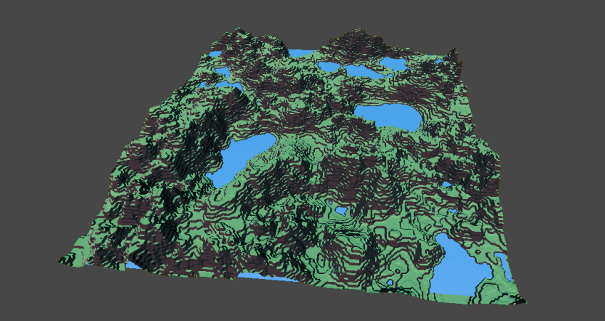
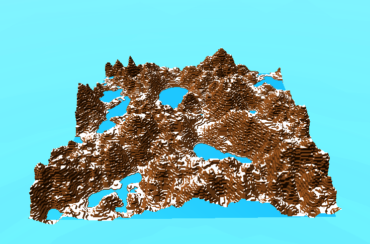

# Low Poly Terrain

C# Unity project that generates a procedural terrain from a noise texture using an [MIT Licensed implementation of Marching Cubes](https://github.com/Scrawk/Marching-Cubes).

## Demo scene
WASD to move around

Left Shift to move up

Left Ctrl to move down


Right click to delete voxel

Left click to create voxel


## Algorithm

Width/Length must be the same as the number of pixels in the noise texture.
Noise is expected to be clamped between 0 and 1.

All three dimensions are packed into a single float array to represent voxels, using the formula 
- [x + y * width + z * width * height]

To check whether a voxel is full:

- Sample noise texture at (width, length); ``` noise.sample(x, z):```
- Multiply above value by height ``` heightVal = noise.sample(x.z) * height```
- ```if(currentVoxel.y < (int)heightVal) voxelValue = 1;```
- If the height is between the floored heightVal and heightVal, set the voxel to the difference between the two instead of 1.
```float diff = heightVal - (int)heightVal; if(diff < 1 && height > (int)heightVal && height < heightVal) voxelValue = diff;```

## Images
## [Youtube Demo](https://www.youtube.com/watch?v=6rcKqbRc4lY)




# Donate (click image)

[](https://www.buymeacoffee.com/ZcRuWpUBf)


